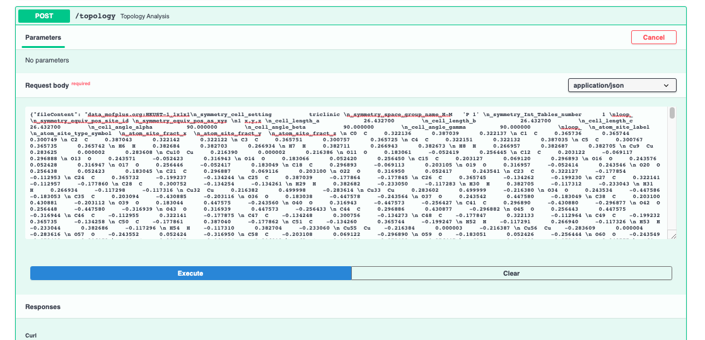

# crystal_analysis_webservice


This is a webservice built using [FastAPI](https://github.com/tiangolo/fastapi). It exposes the great [Julia topology analysis code developed by Lionel Zoubritzky](https://github.com/coudertlab/CrystalNets.jl).

We will add more tools, like zeo++ in due course.

The service also uses file-based caching, using the `md5` hash of `fileContent` as key.

## Usage

To be usable on Heroku or Dokku, which use `PORT`environmental variables, you need to either create this environmental variable or put it into an `.env` file. You can start by renaming `.env.sample` to `.env`.

### Development

For local development, the `run_docker.sh` script uses `8091`.

```bash
./build_docker # builds the docker image
./run_docker # starts the service
```

### Deployment

For production, you may want to use Docker compose

```bash
docker-compose up --build -d
```

To test the image, you can go to `localhost:$PORT/docs`.

You could for example, use the request body from one of the files in the folder `.example_requests`.

<a href="url"></a>

The analysis takes some time (1--2 min) and should result in an object of the following form

```
{
  "rcsrName": "string",
  "apiVersion": "string",
  "rcsrLink": "string"
}
```

<a href="url"></a>

## Settings

For the image to work, you need to specify a few settings. You can do this, for example, via an `.env` file:

- `CONCURRENCY_LIMIT` limits the number of concurrent connections before we raise a `503` error.
- `WORKERS` number of workers, we use on CPU per worker
- `PORT` will be the port number at which you can reach the app

## Docs

You find docs on `http://127.0.0.1:$PORT/docs.`
